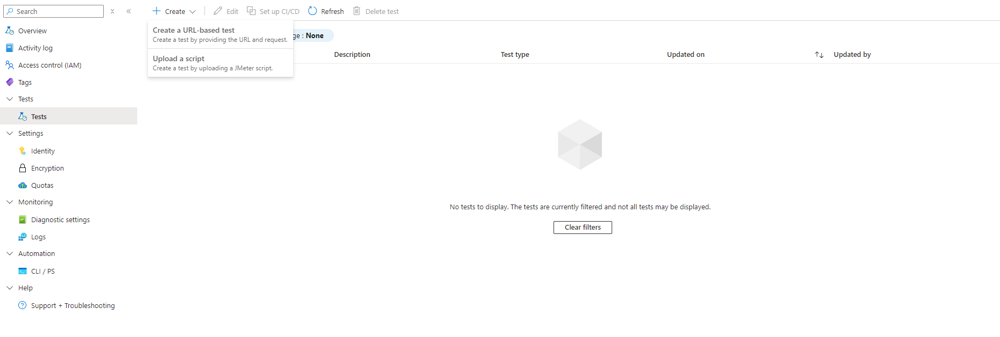
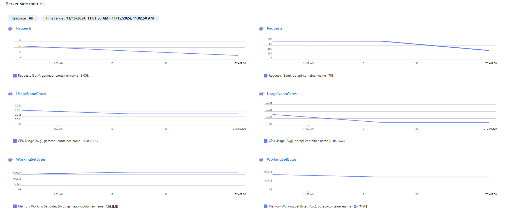
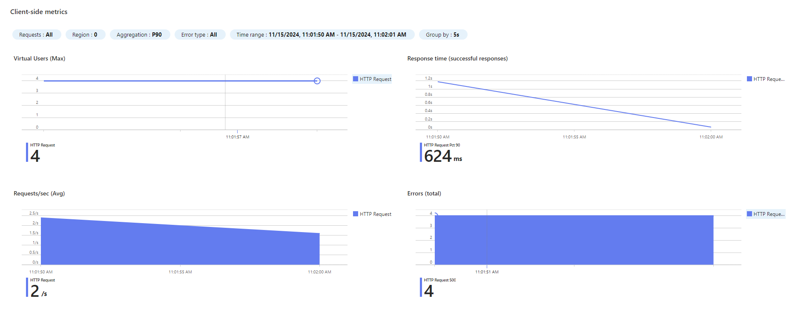

# Module 3 Exercise 1

In this exercise, you will update a JMeter script to target your containerized game and bot APIs correctly. Then, you’ll create and configure an Azure Load Test, run performance tests, and analyze the results to assess how well your containers handle high loads. Based on the performance data, you’ll scale up the containers as needed and rerun the tests to confirm improvements. This hands-on activity will teach you how to effectively load test and scale containerized applications using Azure.

## Estimated time: 15-20 Minutes

## Learning objectives

- Deploy and configure Azure Load Testing
- Implement auto-scaling

## Prerequisites

To begin this module you will need the Azure resources that you deployed in both **Module 1: Azure Architecture Introduction** and **Module 2: External Communication**

## Step 1: Update JMeter script for Azure Load Testing

We will use a JMeter script to define and execute load tests, simulating user activity on our application. This helps us measure performance under different traffic conditions and identify potential bottlenecks using Azure Load Testing.

 1. Open the **HTTP_Request.jmx** file in the JMeter folder.
 2. Replace the placeholder values with the correct Azure container app host names.

- **!game-container-api-HN!** = HostName from Game Container Api
- **!bot-container-api-HN!** = HostName from Bot Container Api

## Step 2: Create an Azure Load Testing resource and use the test

1. Using [Azure Portal](https://portal.azure.com/), create an **Azure Load Test** in your designated **$apiResourceGroup** and **$location**.
2. Navigate to the **Tests** tab and click on **Create** to "Upload a script."

   

3. Give your test a meaningful name.
4. On the **Test Plan** tab, upload the following files from the JMeter folder (located in Module 3):

   - **HTTP_Request.jmx**
   - **parameters.csv**

5. On the **Load** tab, adjust the **Engine instances** settings. Here, you can set how frequently you want the requests to be made.
6. On the **Monitoring** tab, add your game and bot container apps to monitor their behaviour during the test.
7. Click **Review + create** to finalize and set up your load test.

## Step 3: Analyze and scale up container apps

1. Once your test completes, review the results to see how well your containers performed.
   - You can view metrics for your container, including **Requests, UsageNanoCores and WorkingSetBytes**.
   
   - Additionally, you can access client-side metrics, such as the total number of requests made during the test and their average response time.
   

2. To monitor performance, go to the **Monitoring** section in both of your container apps and check the **Metrics** tab. Look at the maximum CPU usage during the test.
3. Increase the container app's capacity:
   - Go to the **Scale** tab under the **Application** section.
   - Adjust the **min and max replicas** for both the game and bot containers to improve performance. Make sure to scale both game and bot api containers.
   

## Step 4: Rerun the same test deployed on Azure Load Testing

1. Return to the Azure Load Test in the portal.
2. Select the previous test and click Run to execute it again, or choose to rerun your last existing test run.
   

## Step 5: Readjust scales on container apps

- Adjust the **min and max replicas** for both the game and bot containers to 1 instance. Make sure to scale both game and bot api containers.
