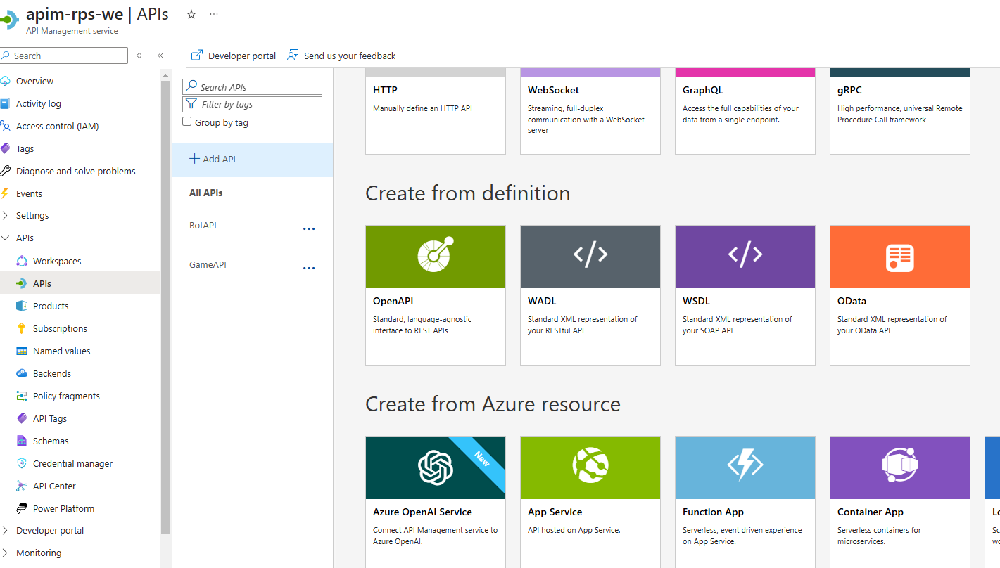

# Module 4: Caching Strategies
In this module, you will learn about various caching strategies to improve the performance and reliability of your applications.

# Exercise 1
In this exercise you will deploy a new API that generates a leaderboard for your Rock, Paper, Scissors game. 

## Estimated time: 30 minutes

## Learning objectives
   - Implement caching on Cosmos DB data to decrease the RUs consumption 

## Prerequisites

To begin this module you will need the Azure resources that you deployed in the first region during **Module 1: Azure Architecture Introduction** and the API Management that you deployed during **Module 2: External Communication**

During this module you will also need the following PowerShell variables used previously:
 - $GitPAT - your GitHub token (PAT) value
 - $GitRepositoryOwner - your GitHub owner name (lowercase)
 - $APIResourceGroup - name of the Resource Group in which you have your Container APIs and Static Web App, from the first region
 - $ManagedEnvironment - name of the Managed Environment for the first region
 - $GameApi - name of your Game API resource
 - $BotContainerUrl - URL for your Bot Container API
 - $GameContainerUrl - URL for your Game Container API
 - $SMTP - connection string of your Azure Communication Service deployed in Module 2
 - $Sender - your noreply email from the Email Communication Service Domain resource deployed in Module 2

## Step 1: Deploy StatsAPI
You need to deploy the new API and set the Connection String of the CosmosDB resource as an Environment Variable. You can set the cache duration as well.

To find the Connection String of the CosmosDB:
1. Open the [Azure Portal](https://portal.azure.com/).
2. Navigate to your **CosmosDB** resource.
3. On the side menu, under the **Settings** tab, click **Keys**
4. The Connection String is under **PRIMARY CONNECTION STRING**

To deploy the StatsAPI container, run the commands from the `Exercise.ps1` file, found at this step.

## Step 2: Add StatsAPI to Azure API Management
With the StatsAPI up and running, you can now add it to the APIM:
1. Open the [Azure Portal](https://portal.azure.com/).
2. Navigate to your APIM resource
3. Access the **APIs** menu under the **APIs** tab
4. Select **Container App** from the menu
5. Add the StatsAPI container to the APIM, and set "**stats**" as its suffix
   
   

   

> [!IMPORTANT]  
> Make sure to disable the subscription for your Stats API so you'll be able to access it. You can do that by going to the **Settings** tab for the API and unchecking **Subscription Required**.

## Step 3: Redeploy GameAPI and the web app
To be able to deploy the version of the app with the leaderboard functionality, you need to change the deployment workflow under `./github/workflows`, more exactly, you have to change

`app_location: "module-2-external-communication/src/Exercise_2/RockPaperScissors"`

into 

`app_location: "module-4-caching-strategies/Exercise_1/RockPaperScissors"`

and 

`api_location: "module-2-external-communication/src/Exercise_2/RockPaperScissorsAPI"`

into

`api_location: "module-4-caching-strategies/Exercise_1/RockPaperScissorsAPI"`

To redeploy the Game API, run the commands from `Exercise.ps1` file, found at this step.

## Step 4: Test the leaderboard
Now you can access your web app and test the new Leaderboard feature of the app. Data will be added to your leaderboard each time a game has ended, or by pressing the **Generate** button, that will automatically generate mock data for your database. 

The overall leaderboards are computed at an interval based on the **TTL** that you set earlier, so instead of reading the whole records of games, you only read documents already computed with the leaderboard data. That means that when your TTL expires, on the next request to read the leaderboard data, the stats will be computed again.

This method will make the CosmosDB use less Request Units and the interval of caching can be easily changed.
