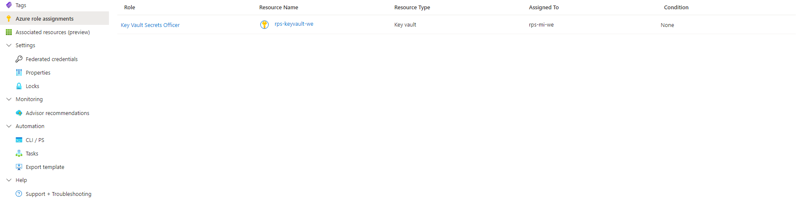
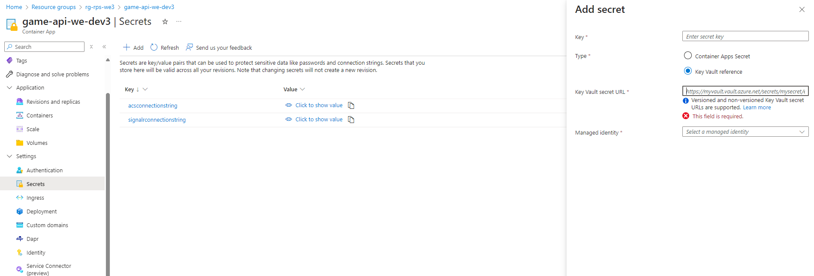

# Module 6: Microservices Arhitecture
In this module, you will learn how to securely manage sensitive information and monitor the performance of your containerized applications in Azure.

You will start by exploring secrets management using Azure Key Vault. You will learn how to securely store critical data like API endpoints and configure access controls using Managed Identities. By the end of this part, you’ll understand how to keep your application secrets safe and integrate them into a containerized environment.

Next, you’ll dive into logging and monitoring using Azure Monitor and Azure Storage. You’ll set up diagnostic settings to capture application logs, store them in a secure location, and learn how to access and analyze these logs. This will help you monitor your app’s health and troubleshoot issues effectively.

# Exercise 1
In this exercise, you will create an Azure Key Vault to securely store API endpoints as secrets, assign appropriate access roles, and set up a Managed Identity. You will then link these secrets to a game API container, ensuring the environment variables are securely configured, and deploy the containerized game application using Azure CLI.

## Estimated time: TODO minutes

## Learning objectives
   - Create and Configure Azure Key Vault
   - Assign Roles for Secure Access
   - Manage and Add Secrets to Key Vault
   - Set Up Managed Identity for Secure Access
   - Use Secrets in a Game API Container
   - Deploy and Configure a Container Application

## Prerequisites
During this module you will also need 7 of the PowerShell variables used previously:
   - $SignalREndpoint - SignalR connection string
   - $APIResourceGroup - name of the Resource Group in which you have your Container APIs and Static Web App, from the first region
   - $SMTP - connection string of your Azure Communication Service deployed in Module 2
   - $GameApi - name of the Game Container API deployed in the first region
   - $Sender - Azure Managed Domain MailFrom address
   - $GameContainerUrl -  URL for your Game Container API
   - $BotContainerUrl - URL for your Bot Container API

## Step 1: Create an Azure Key Vault
 Choose a name for your KeyVault and follow the commands from the .ps1 file

## Step 2: Assign Roles for Key Vault Access
Assign the necessary roles to allow access to the Key Vault.

2.1. Define your subscription information

- `<subscription-upn> = refers to your Subscription User Principal Name (UPN). You can find this by opening Microsoft Entra ID in the Azure portal or by clicking on your profile picture in the top-right corner, under your name.`
- `<subscription-id> = Your subscription Id`

2.2 Create a role assignment for Key Vault Secrets Officer

## Step 3: Add Your Endpoints as Secrets to the Key Vault
Store your endpoints as secrets in the Key Vault:

3.1 Add the SignalR endpoint as a secret

3.2 Add the ACS (SMTP) endpoint as a secret

## Step 4: Create a Managed Identity and Assign Roles

4.1 Create a Managed Identity using the following script:

4.2 Using [Azure Portal](https://portal.azure.com/):
- Navigate to Azure role assignments.
- Create a new role assignment for the Key Vault named **Key Vault Secrets Officer** and assign it to your Managed Identity.

## Step 5: Use Key Vault Secrets in the Game API Container

5.1 Using [Azure Portal](https://portal.azure.com/):
- Go to the **Secrets** section under the settings tab of your Key Vault.
- Add a secret named **acsconnectionstring**.
    - For the Key Vault Secret URL, copy the URL of the ACS secret you created.
    - Link it to the Managed Identity created in the previous step.
- Repeat the process for **signalrconnectionstring** to add your SignalR endpoint secret.

5.2 Use the .ps1 command to apply the secrets as environment variables for your game API container